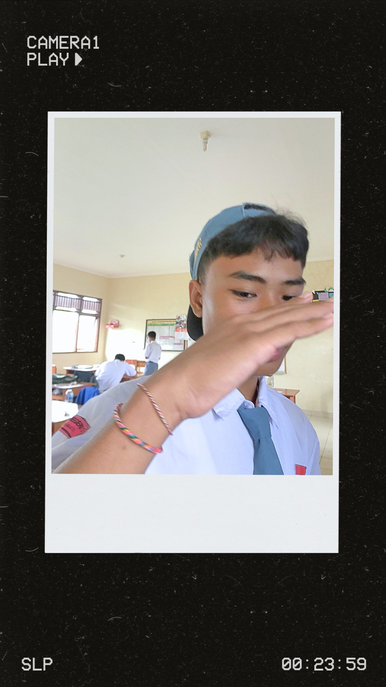

<!-- Header Animasi dengan Nama -->

<!-- Foto Profil -->

  

<!-- Deskripsi Diri -->
## ✨ About Me
Saya role nya sebagai fullstak web develop, aktif di beberapa project open sorce,
Sekarang saya berdomisili di Bali/Gianyar , Murid Sekolah SMK NEGRI 3 SUKAWATI JURUSAN RPL 
, Saya siap berkontribusi dan solve problem together in my team.

--📧 = kadekisaka00@gmail.com

--📧 = kadekisaka28@icloud.com

---

<!-- Statistik GitHub -->
## 📊 GitHub Stats

  

---

<!-- Bahasa & Tools dengan Animasi Bergerak -->
## 🚀 Languages & Tools

  

  

---

<!-- Quotes -->
## 🌟 Inspirational Quote
> "Do the best and got to the rest"

---

<!-- Animasi Footer -->

