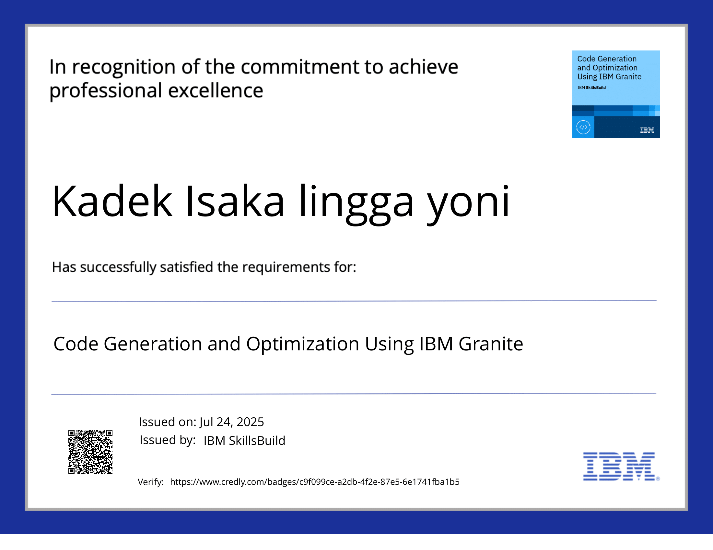
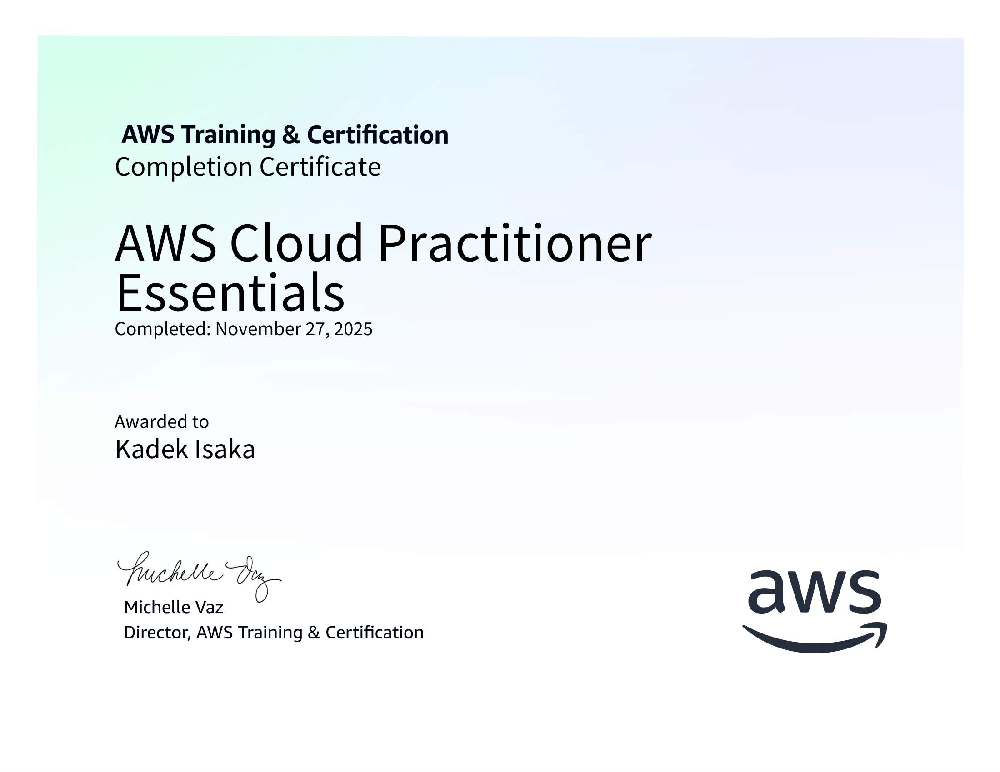
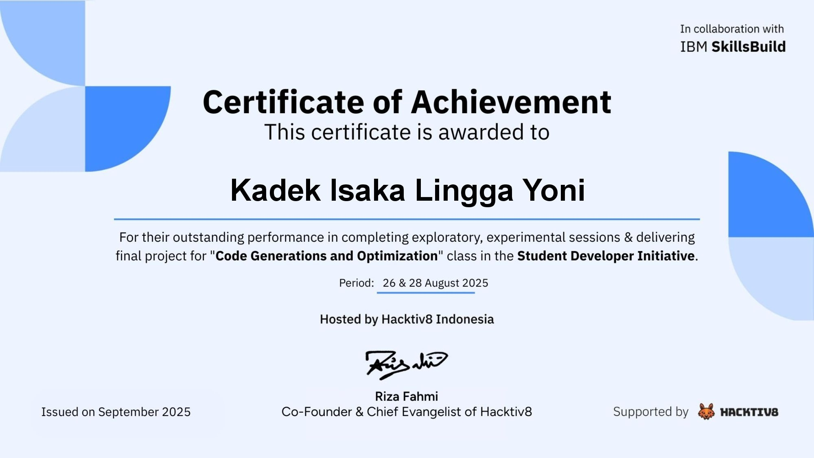

  
  
  #  Hi there,I'm Mipan
  
  

    <em>A passionate student developer from Indonesia</em> 
    <em>I Love a dog 🐶 and Cat 😺</em>
  

  
  
  
  

---

## 📊 My Stats GitHub

  
  

    

---

## 🛠️ Knowledge and learning

  
frontEnd

    
  
BackEnd

    
  
DevOps

    
  
Database

    
  
Tools

    

  

---

## 🏅 Certificates

  
  
  

---

## 🌟 Quotes
> *Do The Best And God Do The Rest*

---

## Activity

  
  
  

