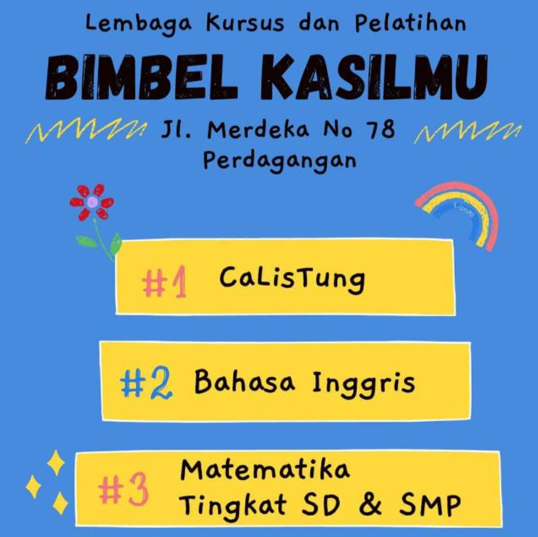

  

## ✨ U Must Know Me
- 🧑‍💻 I’m a **Fullstack Web Developer**.
- 🌱 Currently learning **JavaScript & Java**.
- ⚡ Can use framework  
- 🎯 Passionate about **Frontend & Backend Development**.
- 📫 Reach me at: (kadekisaka00@gmail.com | kadekisaka28@icloud.com)
- 
  
  

    

---

## 📊 My Stats GitHub

  
  

    
  

---

## 🏢 Project Open Sorce

  

---

## 🛠️ Knowledge and learning

  

  

---

## 🌟 Quotes
> *Do The Best And God Do The Rest*

---

## Activity

  
  
  

